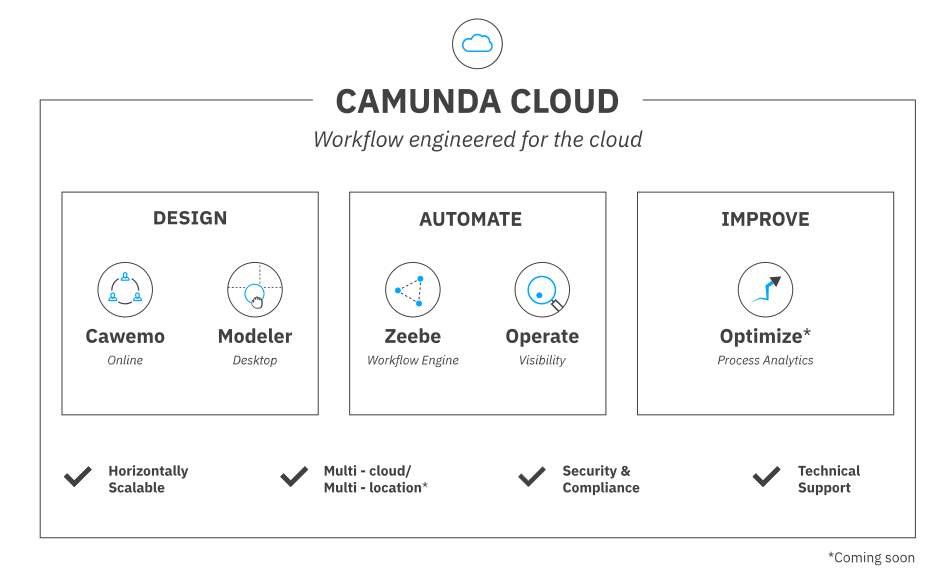
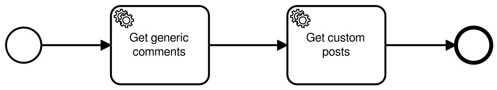

# Zeebe: A workflow engine for microservice orchestration in the cloud

---


* User Groud: [Camunda User Group Karlsruhe - Ettlingen](https://www.meetup.com/de-DE/Camunda-User-Group-Karlsruhe-Ettlingen/)
* Date: 2020/01/15
* Event: [https://www.meetup.com/de-DE/Camunda-User-Group-Karlsruhe-Ettlingen/events/267084984/](https://www.meetup.com/de-DE/Camunda-User-Group-Karlsruhe-Ettlingen/events/267084984/)

---

## Links

* Camunda: [Website](https://camunda.com/)
* Camunda Cloud: [Product](https://camunda.com/products/cloud/) and [Cloud Console](https://console.cloud.camunda.io/)
* Zeebe: [Website](https://zeebe.io/) and [GitHub Repo](https://github.com/zeebe-io/zeebe)
* Zeebe Modeler: [GitHub Repo](https://github.com/zeebe-io/zeebe-modeler) and [releases](https://github.com/zeebe-io/zeebe-modeler/releases)
* Zeebe Control: [GitHub Repo](https://github.com/jwulf/zbctl) and [npm module](https://www.npmjs.com/package/zbctl)
* Cawemo: [Website](https://cawemo.com/)

## Prerequisites

* Camunda Cloud Account
* *Zeebe Modeler* and *Zeebe Control* installed
* Optional: Cawemo Account

## Demo



1. Optional: Designing a new workflow with **Cawemo**
2. Configuring service tasks with **Zeebe Modeler**
3. Creating a new **Zeebe Cluster** in the **Cloud**
4. Preparing cluster:
  a. Adding some worker variables
  b. Creating a new Client to interact with Zeebe
5. Using **Zeebe Control** to
  a. Get status information
  b. Deploy a new workflow
  c. Start a new instance
6. Using **Operate** to inspect instances

## Workflow

### Consumed services

* `GET https://my-json-server.typicode.com/urbanisierung/meetups/posts/1`
* `GET https://jsonplaceholder.typicode.com/comments/1`

### Cawemo workflow

[](https://cawemo.com/share/bf1c89f8-afab-462f-8758-b93a1f770b73)

### Zeebe Modeler

Each service task needs the following configuration:

* Type: `CAMUNDA-HTTP`
* Retries: 1
* Headers:
  * Key: `url`, value: `https://jsonplaceholder.typicode.com/comments` (change url for the second one)
  * Key: `method`, value: `GET`

## Client interaction

### Environment variables

You get those values in the cloud console:

* `ZEEBE_ADDRESS`
* `ZEEBE_CLIENT_ID`
* `ZEEBE_CLIENT_SECRET`
* `ZEEBE_AUTHORIZATION_SERVER_URL`

#### Status

```bash
zbctl status
```

returns:

```bash
Cluster size: 1
Partitions count: 2
Replication factor: 1
Brokers:
  Broker 0 - zeebe-0.zeebe-broker-service.5b629b87-3b85-4484-b0a6-55b66a577226-zeebe.svc.cluster.local:26501
    Partition 1 : Leader
    Partition 2 : Leader
```

#### Deployment

```bash
zbctl deploy 2020-01-15-demo-workflow.bpmn
```

returns:

```json
{
  "key": 2251799813685259,
  "workflows": [
    {
      "bpmnProcessId": "demo-workflow",
      "version": 1,
      "workflowKey": 2251799813685258,
      "resourceName": "2020-01-15-demo-workflow.bpmn"
    }
  ]
}
```

#### Create new instance

```bash
zbctl create instance demo-workflow
```

returns:

```json
{
  "workflowKey": 2251799813685258,
  "bpmnProcessId": "demo-workflow",
  "version": 1,
  "workflowInstanceKey": 2251799813685264
}
```
